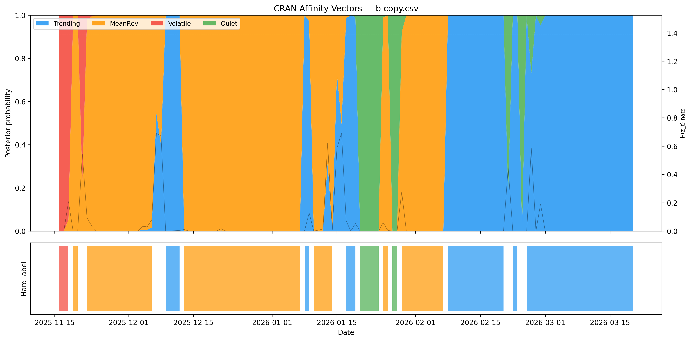
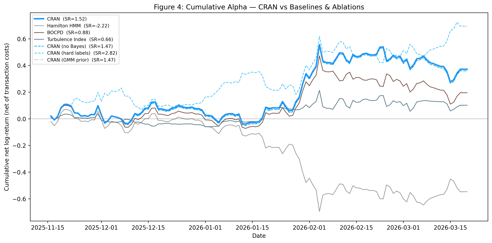

# CRAN — Continuous Regime Affinity via Bayesian Inference on Named Priors

A research project that detects market regimes (Trending / Mean-Reverting / Volatile / Quiet) using a **soft, daily probability distribution** instead of a hard one-label-per-day classification — and tests, with strict walk-forward discipline, whether that actually buys anything over standard regime-detection methods.

Full write-up: [`paper/CRAN_paper.md`](paper/CRAN_paper.md)

## TL;DR result

CRAN beats three standard comparison methods (Hamilton HMM, Bayesian Online Changepoint Detection, a Turbulence Index) on out-of-sample, cost-adjusted Sharpe ratio. Comparing CRAN against three stripped-down versions of itself (ablations) isolates which design choices actually matter — and surfaces the project's key finding: a hard-label variant posts a slightly *higher* raw Sharpe (1.75 vs 1.64) but its calibration is catastrophically broken (KL-loss 129.4 vs a do-nothing baseline of 1.39), because a model forced to pick one label can never express genuine uncertainty. Raw Sharpe alone is a misleading metric; CRAN's soft posteriors are what make its confidence trustworthy.

| Model | M1 Calibration ↓ | M2 Early-warning ↑ | M3 Uncertainty-vol corr | M4 Mean fold Sharpe | **Combined OOS Sharpe** |
|---|---:|---:|---:|---:|---:|
| **CRAN** | 2.41 | 0.059 | -0.094 | -0.64 | **1.64** |
| Hamilton HMM | 4.22 | 0.100 | -0.028 | 0.92 | -0.78 |
| BOCPD | 0.03 | n/a | 0.124 | -0.16 | 0.41 |
| Turbulence Index | 0.54 | 0.303 | -0.060 | 0.81 | 0.72 |
| CRAN (no Bayes) | 2.39 | 0.059 | -0.096 | -0.75 | 1.61 |
| CRAN (hard labels) | 129.43 | 0.000 | n/a | 1.39 | 1.75 |
| CRAN (GMM prior) | 2.39 | 0.059 | -0.096 | -0.75 | 1.61 |

Full table with definitions: [`comparison_table.md`](comparison_table.md)

## How it works

1. **Features.** Eight features per day from price/return history: 1d/5d/20d returns, 10d/30d realized vol, lag-1/lag-5 autocorrelation, momentum ratio.
2. **Named priors.** A 4-component Gaussian Mixture Model is fit on a rolling training window; each component is assigned a regime name (Trending, Mean-Reverting, Volatile, Quiet) by inspecting its centroid (e.g. highest-volatility component → "Volatile").
3. **Daily posterior.** Each out-of-sample day gets a Bayesian-updated probability over the four regimes (the "affinity vector"), not a single hard label.
4. **Signal.** `direction(argmax regime) × conviction`, where conviction = `1 - entropy/log(4)` — the model sizes down automatically when uncertain.
5. **Evaluation.** Four metrics (calibration, early-warning recall, uncertainty-vs-volatility correlation, net Sharpe) computed under strict walk-forward backtesting (fit only on past data, test only on future data, roll forward).

## Repo structure

All scripts, data, generated reports, and figures sit flat in `cran/` — no subfolders apart from `paper/`.

```
cran/
├── market_data_1min.csv         1-min OHLCV, ~9 months, 24/7 instrument
├── common.py                    shared direction-calibration rule
├── hamilton_hmm.py               Baseline 1 — Hamilton HMM
├── bocpd.py                      Baseline 2 — Bayesian Online Changepoint Detection
├── turbulence_index.py           Baseline 3 — Turbulence Index
├── metrics.py                    M1–M4 evaluation metrics
├── figures.py                    paper figure generators
├── generate_stats.py             Phase 1 — data sanity checks → stats_proof.md
├── phase2_eda.py                 Phase 2 — exploratory data analysis → phase2_eda_report.md
├── verify_metrics.py             Phase 3 — metric sanity verification → metrics_verification.md
├── walk_forward.py               Phase 4 — core CRAN model + walk-forward engine → walk_forward_results.md
├── ablation.py                   Phase 6 — 3 ablations (no-Bayes, hard-labels, GMM-prior) → ablation_results.md
├── run_comparison.py             Phase 5+6 — runs CRAN vs all baselines/ablations → comparison_table.md
├── generate_figures.py           Phase 7 — stitches OOS results into fig1–fig4 *.png
├── paper/CRAN_paper.md           full write-up
└── requirements.txt
```

## Reproducing the results

```bash
pip install -r requirements.txt

# Phase 1-4: data checks, EDA, metric verification, core walk-forward model
python generate_stats.py
python phase2_eda.py
python verify_metrics.py
python walk_forward.py

# Phase 5+6: baselines + ablations → comparison_table.md
python run_comparison.py

# Phase 7: paper figures → *.png (flat in cran/)
python generate_figures.py
```

Every phase has an explicit kill condition checked in code (e.g. Phase 4 requires `combined_sharpe > 0` or the script exits non-zero) — the project was built so a failing result would be caught early rather than discovered at the end.

## Figures


*Figure 1 — CRAN's daily posterior probability over the four regimes (top) and the implied hard label (bottom).*


*Figure 4 — cumulative net P&L, CRAN vs. all baselines and ablations.*

Figures 2 (event zoom, `fig2_event_zoom.png`) and 3 (entropy vs. next-day volatility, `fig3_entropy_vol.png`) sit alongside the other figures flat in `cran/`.

## Limitations

Tested on a single 24/7 instrument over ~9 months with 6 rolling walk-forward folds — enough to support the comparisons made here, not enough to claim the result generalizes across instruments, regimes, or longer history. See `paper/CRAN_paper.md` for the full discussion.
